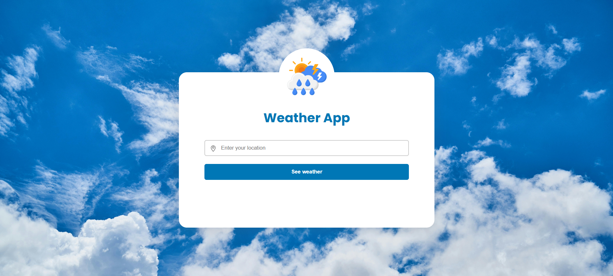

# The Useless Weather App ⛅
This project is a simple weather app mockup. It doesn't fetch real weather data — instead, it displays a loading animation and a static message.
The main goal of this project was to practice and improve my skills in JavaScript, HTML, and CSS, while also getting hands-on experience running a basic server with Node.js.

I was inspired to create this after seeing similar projects online and decided to build my own version as a learning exercise.

### A screenshot of the project:

